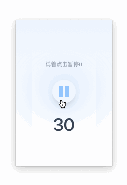
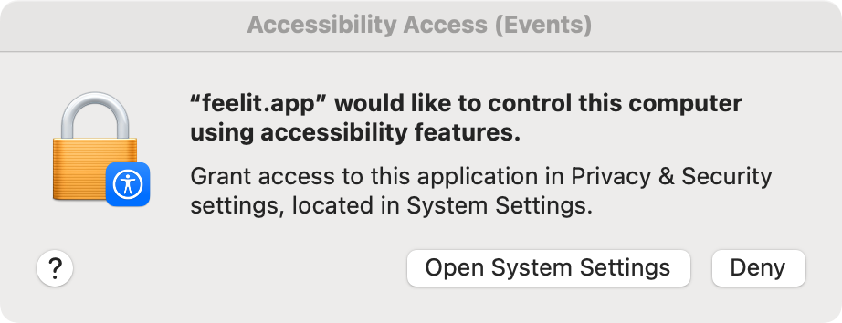

# Feel it

> 当你无法控制自己的身体时,是什么感觉?

感慨易烊千玺在 [小小的我](https://m.douban.com/movie/subject/36498717/) 中的精湛演技
开始思考这个问题,于是有了这个工具

点击开始按钮,30s 内鼠标将会随机抖动,试着让它停下来

### 为什么叫 feel it

`it`指代意识清醒,身体却无法完美控制的感觉

**理解和尊重**的最好办法是`感同身受`

# macOS使用须知

初次使用需要允许授权

点击`打开系统设置` , 允许 app 访问

### 下载

[macOS-apple芯片](https://github.com/GuangYiDing/feelit/releases/download/app-v0.1.0/feelit_0.1.0_aarch64.dmg)

[macOS-intel芯片](https://github.com/GuangYiDing/feelit/releases/download/app-v0.1.0/feelit_0.1.0_x64.dmg)

[Windows](https://github.com/GuangYiDing/feelit/releases/download/app-v0.1.0/feelit_0.1.0_x64-setup.exe)

### 许可证

[MIT](./LICENSE)

